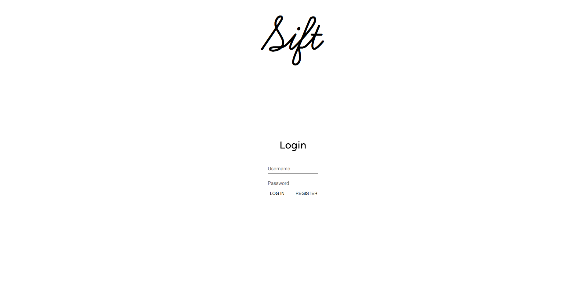
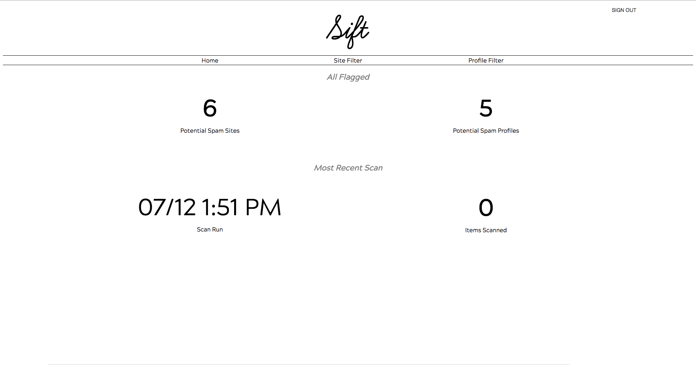
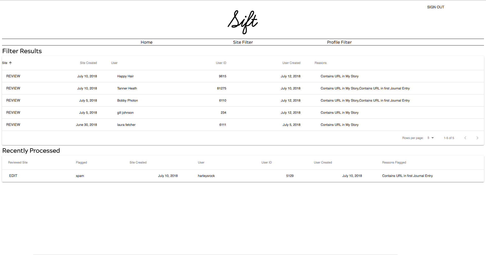
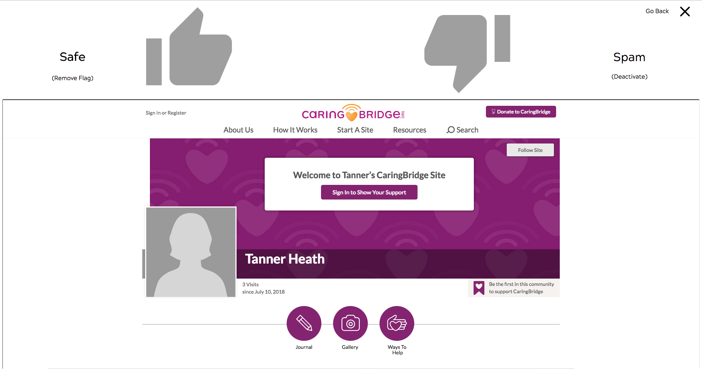
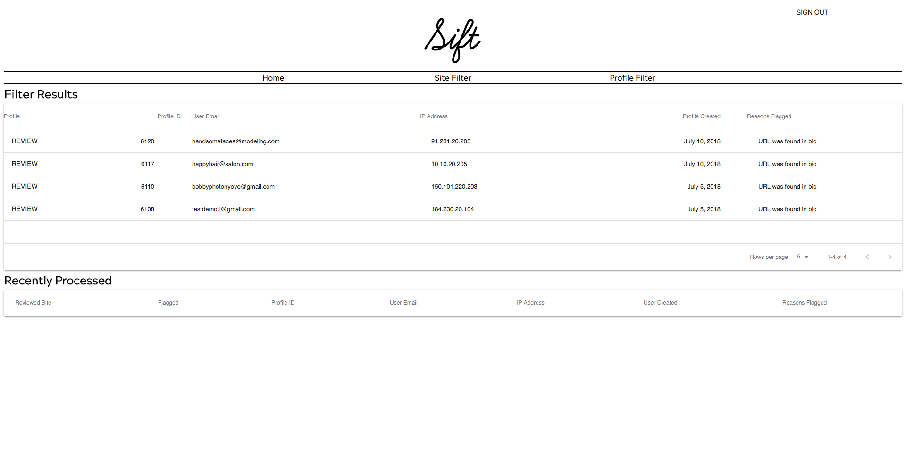
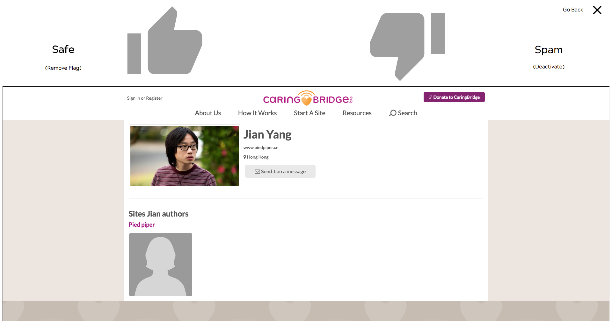

# CB-Filter, a spam filter for Caring Bridge

## Contributors
- Rory Ivance
- Emily Kay
- Ellen Keal
- Bob Petersen
- Jason Phan

## Maintenance 

### Countries
To add/delete countries from the blocklist, go to the file at server/modules/filter/countries.js, and follow the instructions in the comments. 

### Initially Running the App

# Express/Passport with React
This version uses React to control the login requests and redirection in coordination with client-side routing.

## Prerequisites

Before you get started, make sure you have the following software installed on your computer:

- [Node.js](https://nodejs.org/en/)
- [MongoDB](https://www.mongodb.com/)
- [Nodemon](https://nodemon.io/)

## Download (Don't Clone) This Repository

* Don't Fork or Clone. Instead, click the `Clone or Download` button and select `Download Zip`.
* Unzip the project and start with the code in that folder.
* Create a new GitHub project and push this code to the new repository.

## Development Setup Instructions

* Run `npm install`
* Create a `.env` file at the root of the project and paste this line into the file:
    ```
    SERVER_SESSION_SECRET=superDuperSecret
    ```
    While you're in your new `.env` file, take the time to replace `superDuperSecret` with some long random string like `25POUbVtx6RKVNWszd9ERB9Bb6` to keep your application secure. If you don't do this step, create a secret with less than eight characters, or leave it as `superDuperSecret`, you will get a warning.
* Start mongo if not running already by using `brew services start mongodb`
* Run `npm run server`
* Run `npm run client`
* Navigate to `localhost:3000`

### Walk-Through

## Login

First time users will need to click register and create a username and password. Otherwise, here is where you'll login. The application cannot be used unless someone is logged in.



## Home 

Here is the landing page. The sign out button is located in the upper right corner. Users can navigate to different pages via the toolbar listed below the name. 

The statistics on this page include: 

* Potential Spam Sites & Potential Spam Profiles refer to the number of current items that are inside of both filters. 
* Scan Run will run both when/if the server is started as well as on the hour allowing users to ensure that it is still running. If it is not (for example, should the API used for identifying IP addresses goes down), a user will also receive an alert. 
* Items Scanned refers to all items in the most recent scan, including those not flagged. 



## Site Filter

There are two tables located on this page. 

# Filter Results

Each column on this table is sortable. The table populates with sites that have been flagged by the filter as potential spam.

Columns include: 

* Site - button redirects to the site itself where a user can determine if it is indeed spam
* Site Created & User Created - refer to the dates they were created, respectively 
* User & User ID - reference the specific user
* Reasons - all the reasons a site was tagged

Bottom right:

* Rows per page - how many rows per page are visible via drop down menu
* 1-5 of 5 - how many of the total entries, not pages, are being shown
* Arrows - change pages either forward or backward

# Recently Processed

This table is not sortable in order to keep the last three in the order they were processed. The table populates with sites that have been processed by the user that is currently logged in.

Columns that differ from above include: 

* Reviewed Site - button redirects to the site itself where a user can change the way they marked a particular site. Once Edit is clicked, the item will move back to the Filter Results table if neither of the thumb buttons are clicked. 
* Flagged - denotes how the user marked that entry



## Approval for Sites 

Most of the screen shows the actual site that is being marked as spam. Users can scroll through it to verify what triggered the filter. At the top, there are two buttons, a thumbs up (denoting the site as not spam) and a thumbs down (denoting the site as spam and deactivating it). If either of these are clicked, the entry on the previous table will be removed and moved to the Recently Processed table. The Go Back button will not move the entry and allows for users to leave it in the filter to re-review at a later time. 



## Profile Filter 

This filter is very similar to the one listed for Site. The most notable differences are the additions of a user's email and IP address. 



## Approval for Profiles 

This screen is very similar to the one triggered in the Site table. The major difference being that a user's profile, not site, is shown.  



